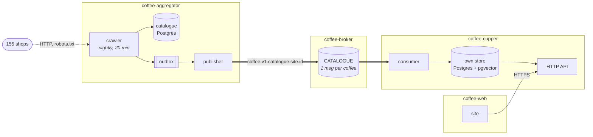
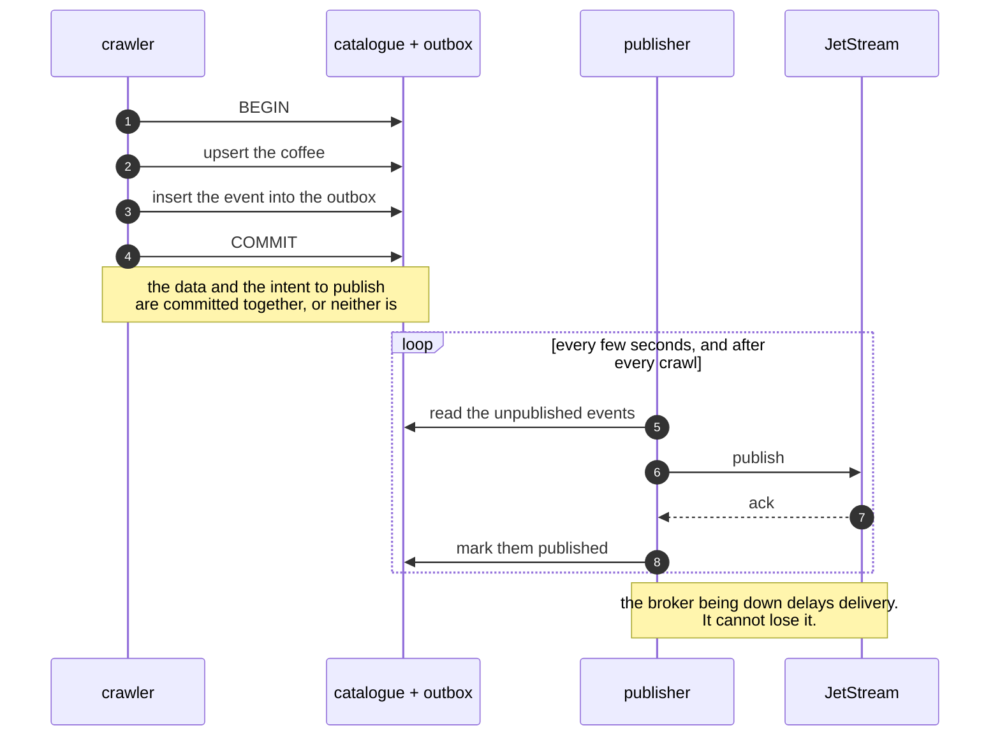
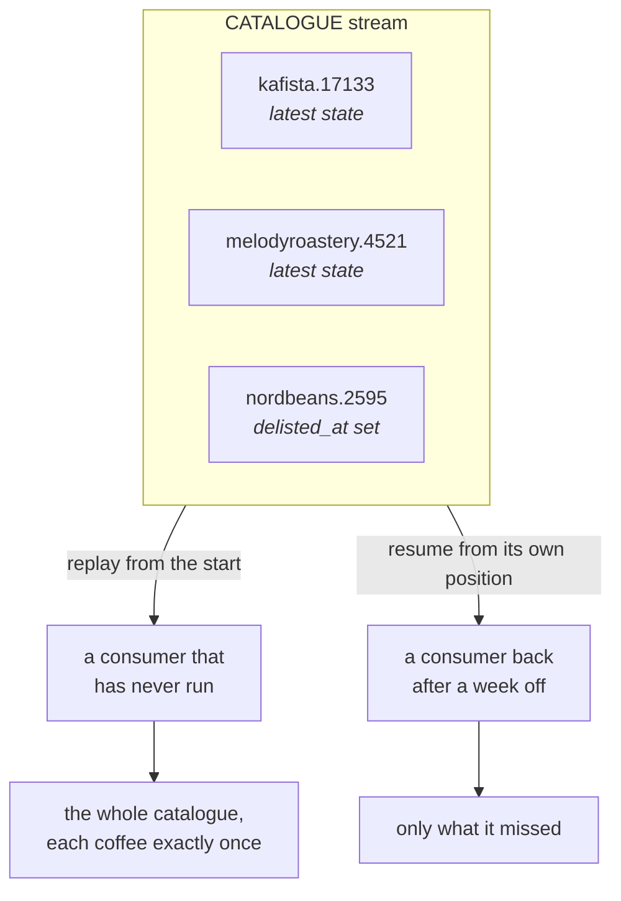
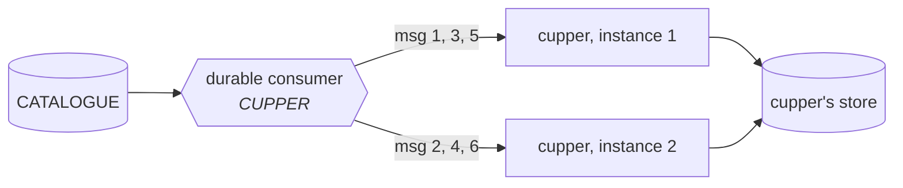

# How the coffee services fit together

**This is the target design, not what runs today.** The broker does not
exist, there is no outbox and no publisher, and `coffee-cupper` currently reads
the aggregator's database directly over a shared Docker network — the one thing
the design below exists to remove. Every thick arrow in the first diagram is
unbuilt. Read this as the destination and `coffee-aggregator/deploy/` as the
present.

Once it is built: independently deployable services and one broker, sharing no
database and calling nothing at runtime, which is what lets each be deployed,
scaled and broken on its own.

It tolerates the failure of a process or a service. It does **not** tolerate
the failure of the host: one machine runs the broker, both databases and every
service, and no amount of durable messaging changes that.

## The pieces

Each box with a database owns it and nobody else reads it. The only things
crossing a boundary are the thick arrows — events — and one HTTP call from the
site to the API.

## Why the outbox

A database transaction and a message broker cannot commit together. Write the
coffee, then publish, and a broker that is down between the two loses the event
silently; publish first and a rollback leaves an event for something that never
happened.

So the event is written **into the catalogue's own database, in the same
transaction as the data**. Publishing is a separate job that reads that table.

An event may be delivered twice — the publisher can be killed between the ack
and the mark. That is why consumers must be idempotent, and why the catalogue
events carry whole state: applying the same state twice is the same as applying
it once.

## Why the catalogue stream is compacted

One subject per coffee, one message kept per subject. The stream stops being a
log of changes and becomes **the catalogue itself**.

This is what makes a second service free to add. No backfill, no export, and
the producer never learns that another consumer exists.

It is also why a delisting is `delisted_at` on the state rather than a deleted
message: deleting it would take the fact with it, and the next replay would
resurrect the coffee.

## Why two consumers need no code

A durable consumer is a position in the stream, held by the broker. Any number
of clients may bind to the same one, and the broker hands each message to
exactly one of them.

Start a second container and the work splits. Stop it and the first one picks
up the rest. Neither the producer nor the contract changes.

## What a failure looks like

| what breaks | what happens |
| --- | --- |
| the broker | the crawl still writes; events wait in the outbox |
| the publisher | same — the outbox is the queue |
| cupper | events wait in the stream; it catches up on restart |
| cupper's store | rebuilt by replaying the stream from the start |
| the aggregator | cupper keeps answering from its own store, with yesterday's data |

The last row is the point of the whole arrangement: the recommender does not
stop working because the crawler does.

## What it costs

Data is duplicated and briefly stale. There is no transaction across the two
services, so "the coffee is in the catalogue" and "the coffee is in the index"
are true at different moments.

For this system that is cheap — a recommender does not need prices accurate to
the second. On a system where it would not be, this architecture would be the
wrong one, and the one database it replaced would be right.
